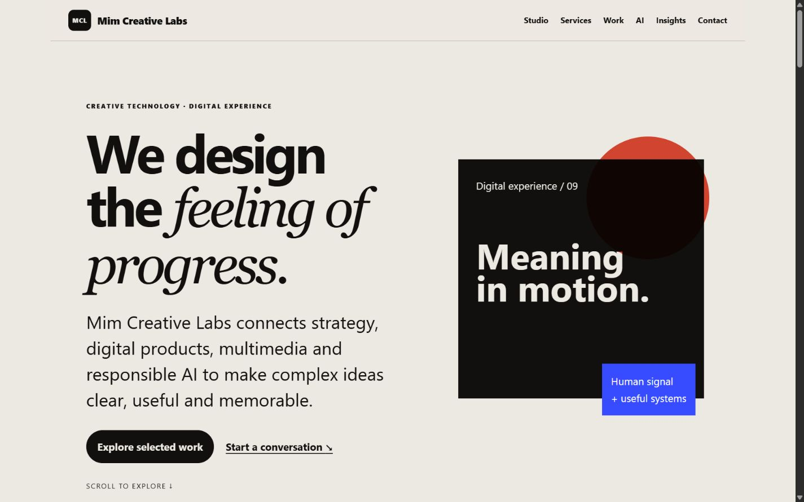

# Mim Creative Labs

Premium creative technology platform demonstrating advanced layout, case studies, multimedia, AI solutions and accessible interactions.

## Live Demo

[Open the live site](https://mim242-40-002-dot.github.io/mim-creative-labs/)

## Screenshot

## Features

- Responsive, semantic single-page architecture
- Accessible navigation, focus indicators and reduced-motion support
- Project-specific interactive components
- Honest client-side form feedback with no fake server submission
- Local optimized assets and descriptive alternative text

## Technologies

HTML5, CSS3 and vanilla JavaScript. No framework or runtime dependency.

## Documentation

- [Project overview](docs/project-overview.md)
- [Architecture](docs/architecture.md)
- [User flow](docs/user-flow.md)
- [Testing](docs/testing.md)
- [Asset credits](docs/asset-credits.md)

## Local use

Open `index.html` directly or serve the folder with any static web server.

## Accessibility and performance

The interface uses semantic landmarks, keyboard-operable controls, visible focus states, responsive images and minimal deferred JavaScript. Measured results are recorded only after testing.

## Verification record

On 11 August 2026 the repository passed static structure, heading, alternative-text, anchor, local-asset, required-file, and JavaScript syntax checks. Five representative viewport checks found no horizontal overflow or broken image. Existing design and evidence were retained.

## Author

Jannatun Nur Mim
Department of Multimedia and Creative Technology
Daffodil International University
Dhaka, Bangladesh
